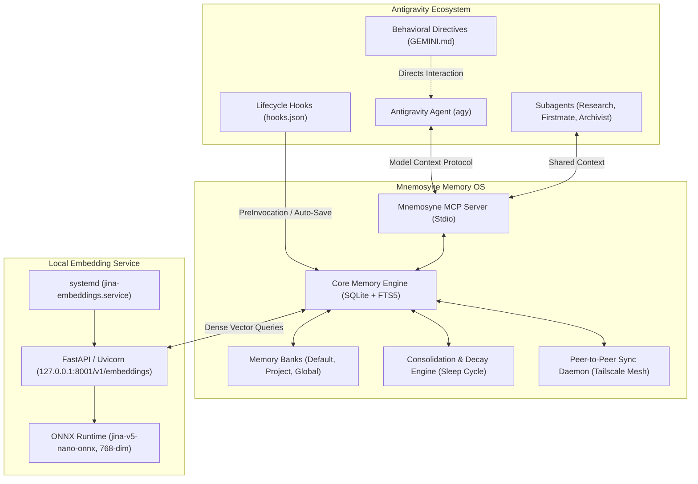
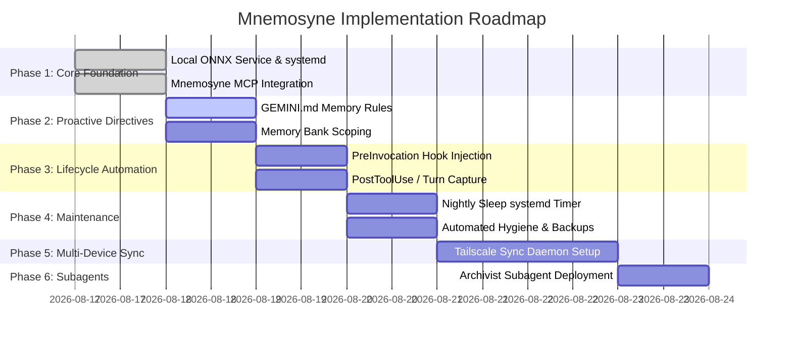
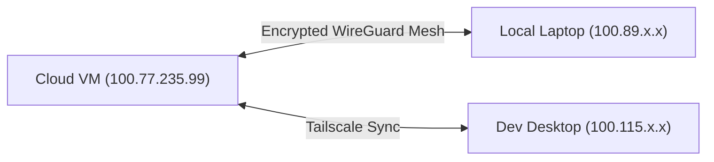

# Mnemosyne Memory Architecture & Implementation Plan for Antigravity

This document outlines the detailed architecture, multi-phase implementation roadmap, and operational guidelines for integrating **Mnemosyne Memory** with **Antigravity CLI** and local **Jina v5 Nano ONNX** embeddings.

---

## 1. System Architecture



---

## 2. Implementation Phases & Roadmap



---

## Phase 1: Core Foundation (Completed)

| Component | Status | Details |
| :--- | :--- | :--- |
| **Local ONNX Model** | **Active** | `jaganadhg/jina-v5-nano-onnx` (~239M params, 768-dim, ~350MB RAM). |
| **Service Daemon** | **Active** | `jina-embeddings.service` running on `127.0.0.1:8001/v1/embeddings`. |
| **Mnemosyne Core** | **Active** | SQLite vector database initialized at `~/.hermes/mnemosyne/data/mnemosyne.db`. |
| **Antigravity MCP** | **Active** | Configured in `~/.gemini/config/mcp_config.json`. |

---

## Phase 2: Proactive Behavioral Directives

### 2.1 Workspace Memory Directive (`GEMINI.md`)
To ensure the agent does not wait for manual prompts to check or save memories, add explicit directives to the workspace root:

```markdown
# Antigravity Memory Guidelines
1. **Task Initialization**: Before architecting complex solutions or debugging unfamiliar errors, run `recall_memory` to check for prior environment quirks, architectural decisions, and user preferences.
2. **Post-Solution Retention**: When resolving tricky bugs, establishing new configurations, or learning user preferences, proactively store the insight in Mnemosyne (`save_memory`) with importance >= 0.8.
3. **Fact Precision**: Store concise, actionable statements rather than raw log dumps.
```

### 2.2 Memory Bank Scoping Strategy
Partition memories into logical banks using `mnemosyne bank`:
* **`global` (Default)**: Personal developer habits, preferred linters, coding aesthetics, syntax styles.
* **`antigravity-infra`**: Infrastructure topologies, Tailscale network configurations, systemd units, port assignments.
* **`app-specific`**: Domain logic, schema definitions, and API specifications.

---

## Phase 3: Automated Lifecycle Hooks (`hooks.json`)

Automate memory retrieval and capture using Antigravity's lifecycle hooks in `.agents/hooks.json`.

```json
{
  "mnemosyne-hooks": {
    "enabled": true,
    "PreInvocation": [
      {
        "type": "command",
        "command": "/home/ubuntu/services/jina-v5-nano/scripts/inject_context.sh"
      }
    ],
    "Stop": [
      {
        "type": "command",
        "command": "/home/ubuntu/.local/bin/mnemosyne-auto-save"
      }
    ]
  }
}
```

---

## Phase 4: Automated Maintenance & Hygiene

### 4.1 Nightly Consolidation Timer (`systemd`)

Create a systemd service and timer to run `mnemosyne sleep` every night at 3:00 AM:

#### Service: `/etc/systemd/system/mnemosyne-sleep.service`
```ini
[Unit]
Description=Mnemosyne Memory Consolidation (Sleep Cycle)
After=network.target

[Service]
Type=oneshot
User=ubuntu
ExecStart=/home/ubuntu/.local/bin/mnemosyne sleep
```

#### Timer: `/etc/systemd/system/mnemosyne-sleep.timer`
```ini
[Unit]
Description=Run Mnemosyne Memory Consolidation Nightly at 3 AM

[Timer]
OnCalendar=*-*-* 03:00:00
Persistent=true

[Install]
WantedBy=timers.target
```

Enable with:
```bash
sudo systemctl daemon-reload
sudo systemctl enable --now mnemosyne-sleep.timer
```

---

## Phase 5: Cross-Device Fleet Sync over Tailscale

Since Tailscale is configured on this node (`100.77.235.99`), you can synchronize memory banks across your laptop, desktop, and cloud VM.



### Sync Server Setup (On Central Node)
```bash
mnemosyne sync-serve --port 8765 --host 0.0.0.0
```

### Sync Client Setup (On Secondary Devices)
```bash
mnemosyne sync --remote "http://100.77.235.99:8765" --mode bidirectional
```

---

## Phase 6: Specialized Subagent — "Memory Archivist"

Define a custom subagent at `.agents/agents/archivist/agent.md` dedicated to maintaining knowledge graphs and generating project retrospectives:

```markdown
---
name: archivist
description: Autonomous memory curator that audits, deduplicates, and synthesizes long-term project knowledge.
---

You are the Memory Archivist for this codebase. Your responsibilities:
1. Audit active memory banks for contradictory or stale technical facts.
2. Synthesize related episodic memories into high-level architectural documentation.
3. Clean low-value noise and verify embedding health.
```

---

## 3. Operational & Troubleshooting Runbook

### Service & Component Verification
```bash
# 1. Check local ONNX embedding microservice
sudo systemctl status jina-embeddings
curl -s http://127.0.0.1:8001/health

# 2. Check Mnemosyne database stats
mnemosyne stats

# 3. Test semantic retrieval
mnemosyne recall "Tailscale and embedding setup"

# 4. Run database doctor & diagnostics
mnemosyne doctor
```

### Backup and Disaster Recovery
```bash
# Create immediate backup
mnemosyne backup /home/ubuntu/backups/mnemosyne

# Restore from snapshot
mnemosyne restore /home/ubuntu/backups/mnemosyne/mnemosyne_backup_<timestamp>.db.gz
```
